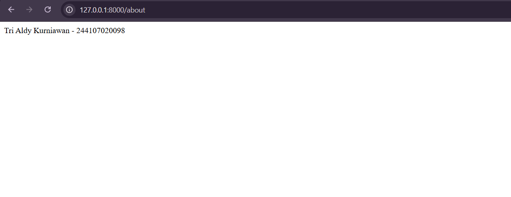
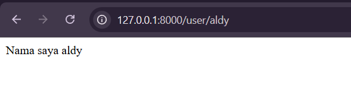
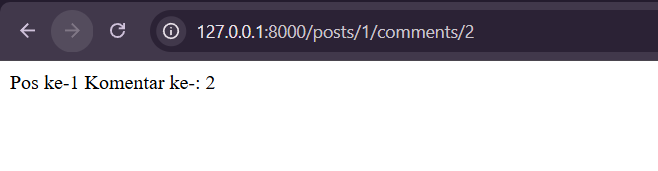

# Laporan PWL

**Tri Aldy Kurniawan**
**244107020098**

---

## Praktikum 1

1. **Routing /About**.
   
2. **Routing dengan parameter**
   
   

3. **Langkah 4**: Jalankan server lokal dengan perintah `php artisan serve` lalu buka browser.
   

4. **Routing dengan Optional Parameter**
   Menambahkan rute ke `/user/{name?}` di dalam `routes/web.php` dengan default parameter `null` atau default nilai lainnya:

    ```php
    Route::get('/user/{name?}', function ($name=null) {
        return 'Nama saya ' . $name;
    });
    ```

**Penjelasan Pengamatan Optional Parameter**:

- Saat mengakses URL `http://localhost:8000/user/` (tanpa memberikan nilai parameter nama pada URL), maka output yang tampil di web hanyalah teks "Nama saya " tanpa diikuti dengan nama apapun. Hal ini terjadi karena parameter `$name` secara _default_ akan bernilai `null` sesuai dengan yang telah diset di rute tadi.
- Saat mengakses URL `http://localhost:8000/user/Aldy` (mengisi `Aldy` sebagai parameter opsional), output akan berubah menjadi "Nama saya Aldy". Laravel menangkap input `Aldy` pada `{name?}` dan mengirimkannya ke function sebagai `$name`.

> **Catatan**:
> Untuk melampirkan gambar, simpan file gambar Anda di dalam folder project (misalnya di folder `assets/images/` atau di folder yang sama dengan file markdown ini) lalu gunakan format `` seperti contoh di atas.
