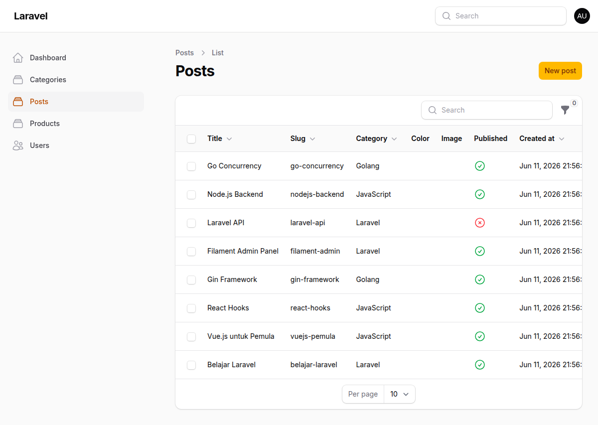
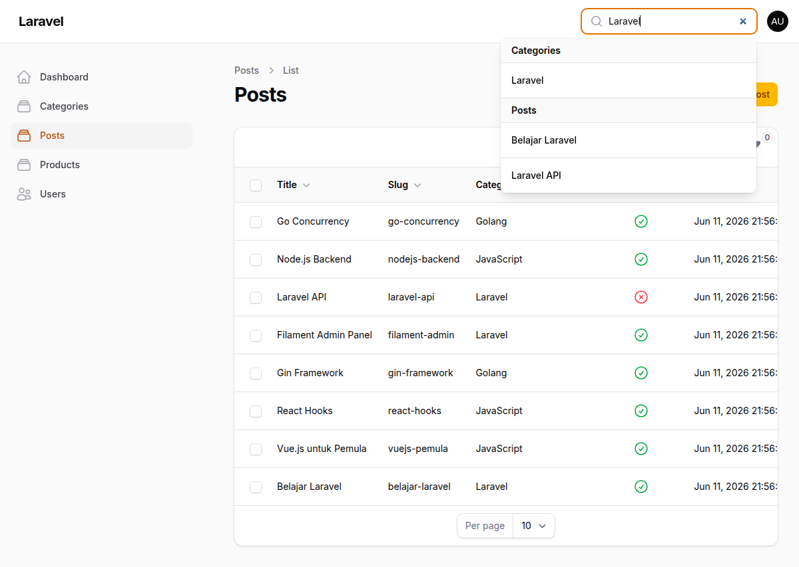
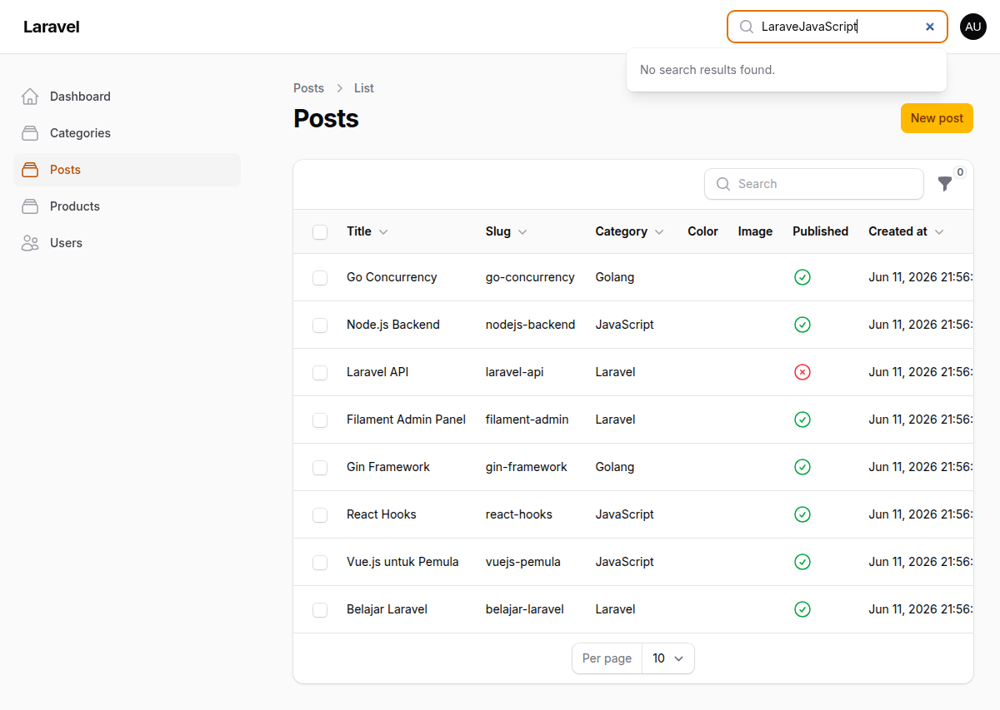
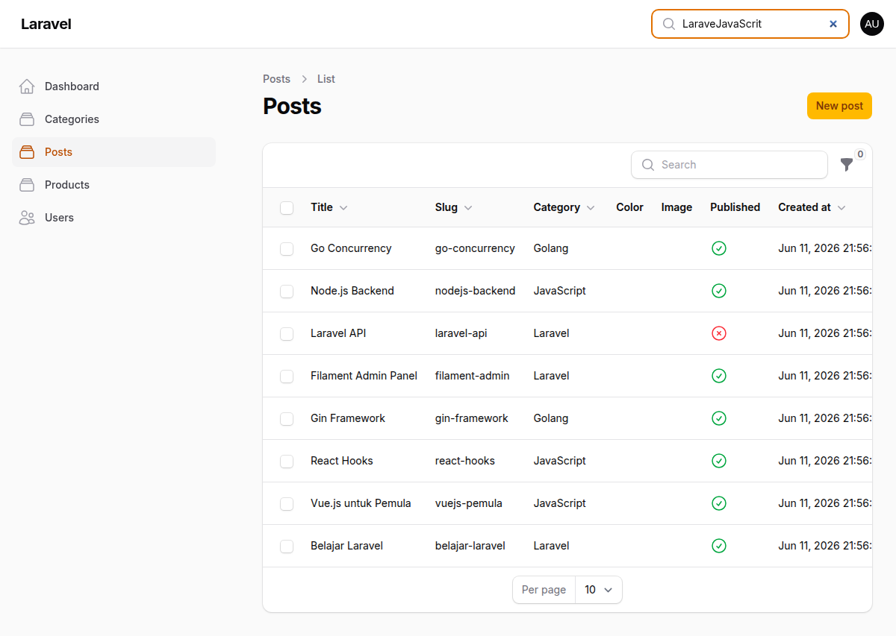
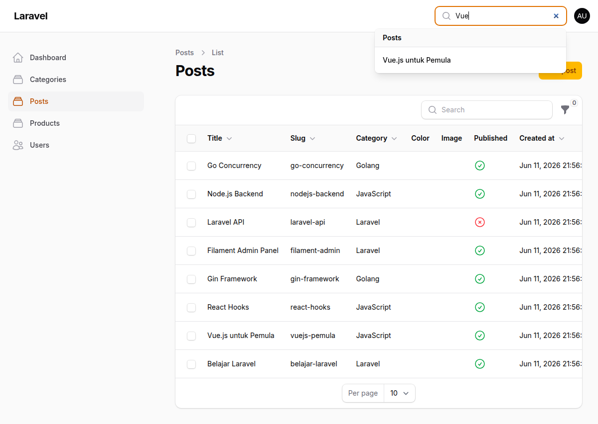

# JOBSHEET 11

**Nama:** Tri Aldy Kurniawan  
**NIM:** 244107020098

---

## Pertemuan 11 — Implementasi Search & Filter pada Table Filament

### Capaian Pembelajaran

Setelah mengikuti praktikum ini, mahasiswa mampu:
1. Menambahkan fitur Search (Pencarian) pada tabel
2. Menggunakan method `searchable()`
3. Membuat filter berdasarkan tanggal (Date Filter)
4. Membuat filter berdasarkan relasi (Select Filter)
5. Menambahkan query custom pada filter
6. Menggabungkan fitur Search dan Filter secara bersamaan

---

### Langkah-langkah Implementasi

#### Langkah 1 — Menambahkan `searchable()` pada Kolom Title, Slug, dan Category

Buka file `app/Filament/Resources/Posts/Tables/PostsTable.php` dan tambahkan method `->searchable()` pada kolom Title, Slug, dan Category:

```php
TextColumn::make('title')
    ->sortable()
    ->searchable(),
TextColumn::make('slug')
    ->sortable()
    ->searchable(),
TextColumn::make('category.name')
    ->sortable()
    ->searchable(),
```

**Hasil:** Search bar muncul otomatis di atas tabel dan bisa mencari berdasarkan Title, Slug, dan Category secara real-time.



---

#### Langkah 2 — Uji Search berdasarkan Title

Ketik "Laravel" di search bar untuk mencari post dengan title yang mengandung kata "Laravel".

**Hasil:** Data terfilter menampilkan hanya post dengan title "Laravel".



---

#### Langkah 3 — Uji Search berdasarkan Category

Ketik "JavaScript" di search bar untuk mencari post dengan kategori JavaScript.

**Hasil:** Data terfilter menampilkan semua post dengan kategori JavaScript.



---

#### Langkah 4 — Menambahkan Filter Tanggal (DatePicker)

Tambahkan import dan filter tanggal di `PostsTable.php`:

```php
use Filament\Tables\Filters\Filter;
use Filament\Forms\Components\DatePicker;

Filter::make('created_at')
    ->label('Creation Date')
    ->schema([
        DatePicker::make('created_at')
            ->label('Select Date'),
    ])
    ->query(function ($query, $data) {
        return $query->when(
            $data['created_at'],
            fn ($query, $date) => $query->whereDate('created_at', $date)
        );
    }),
```

**Hasil:** Filter tanggal muncul di panel filter dengan date picker.


---

#### Langkah 5 — Menambahkan Filter Kategori (SelectFilter)

Tambahkan import dan filter kategori:

```php
use Filament\Tables\Filters\SelectFilter;

SelectFilter::make('category_id')
    ->label('Select Category')
    ->relationship('category', 'name')
    ->preload(),
```

**Hasil:** Dropdown kategori muncul di panel filter dengan semua kategori yang tersedia.



---

#### Langkah 6 — Uji Filter Kategori

Pilih kategori "Laravel" dari dropdown filter.

**Hasil:** Data terfilter menampilkan hanya post dengan kategori Laravel.


---

#### Langkah 7 — Uji Kombinasi Search + Filter

Gabungkan search "Vue" dengan filter kategori "JavaScript".

**Hasil:** Data terfilter menampilkan post dengan kategori JavaScript yang mengandung kata "Vue" di title/slug.



---

### Jawaban Pertanyaan Analisis & Diskusi

1. **Mengapa search tidak cocok untuk filter tanggal?**  
   Search bekerja dengan mencocokkan teks (LIKE query), sedangkan tanggal adalah tipe data temporal yang membutuhkan perbandingan range (before, after, between). Menggunakan search untuk tanggal akan memaksa pengguna mengetik format tanggal secara manual dan tidak fleksibel untuk filtering berdasarkan periode.

2. **Apa fungsi `relationship()` pada SelectFilter?**  
   Method `relationship()` secara otomatis mengambil data dari tabel relasi (dalam hal ini tabel `categories`) dan menampilkan nama kategori di dropdown. Filament menangani query JOIN secara otomatis, sehingga kita tidak perlu menulis query manual untuk mengambil data relasi.

3. **Mengapa kita perlu `whereDate()` pada query filter?**  
   `whereDate()` digunakan untuk membandingkan hanya bagian tanggal (tanpa waktu) dari kolom datetime. Tanpa `whereDate()`, filter akan membandingkan tanggal dan waktu secara eksak, sehingga tidak akan menemukan data yang dibuat pada hari yang sama tetapi dengan waktu berbeda.

4. **Apa perbedaan `searchable()` dan `filters()`?**  
   `searchable()` mengaktifkan pencarian teks real-time pada kolom tertentu melalui search bar di atas tabel. `filters()` menyediakan panel filter terpisah dengan form input (datepicker, select, dll) untuk filtering berdasarkan kondisi spesifik seperti tanggal, kategori, atau status. Search cocok untuk pencarian teks cepat, sedangkan filter cocok untuk kondisi yang lebih kompleks.
