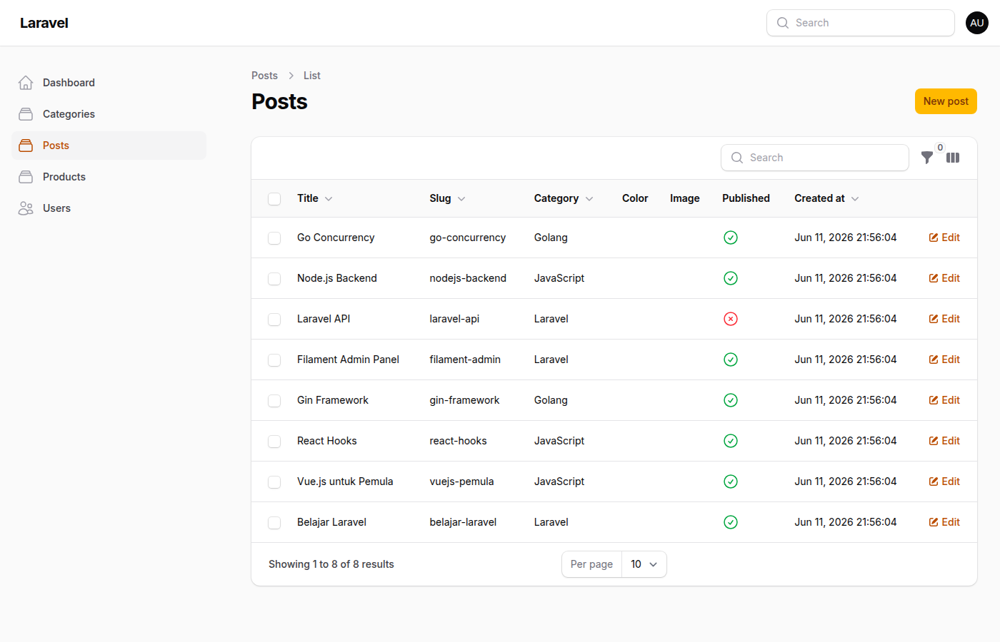

# JOBSHEET 12

**Nama:** Tri Aldy Kurniawan  
**NIM:** 244107020098

---

## Pertemuan 12 — Implementasi Toggle Column pada Table Filament

### Capaian Pembelajaran

Setelah mengikuti praktikum ini, mahasiswa mampu:
1. Menambahkan kolom baru pada tabel Filament
2. Menggunakan IconColumn untuk boolean
3. Mengaktifkan fitur toggleable() pada kolom
4. Mengatur kolom agar tersembunyi secara default
5. Memahami cara kerja penyimpanan preferensi kolom (session)

---

### Langkah-langkah Implementasi

#### Langkah 1 — Menambahkan Kolom ID dan Tags

Buka file `app/Filament/Resources/Posts/Tables/PostsTable.php` dan tambahkan kolom ID dan Tags:

```php
TextColumn::make('id')
    ->label('ID')
    ->toggleable(isToggledHiddenByDefault: true),
TextColumn::make('tags')
    ->label('Tags')
    ->toggleable(isToggledHiddenByDefault: true),
```

**Hasil:** Kolom ID dan Tags ditambahkan ke tabel, tetapi disembunyikan secara default.

---

#### Langkah 2 — Menambahkan `toggleable()` pada Semua Kolom

Tambahkan method `->toggleable()` pada semua kolom agar user bisa memilih kolom mana yang ingin ditampilkan:

```php
TextColumn::make('title')
    ->label('Title')
    ->sortable()
    ->searchable()
    ->toggleable(),
TextColumn::make('slug')
    ->label('Slug')
    ->sortable()
    ->searchable()
    ->toggleable(),
TextColumn::make('category.name')
    ->label('Category')
    ->sortable()
    ->searchable()
    ->toggleable(),
ColorColumn::make('color')
    ->toggleable(),
ImageColumn::make('image')
    ->disk('public')
    ->toggleable(),
IconColumn::make('published')
    ->boolean()
    ->label('Published')
    ->toggleable(),
TextColumn::make('created_at')
    ->dateTime()
    ->sortable()
    ->toggleable(),
```

**Hasil:** Semua kolom sekarang bisa di-toggle melalui menu settings di kanan atas tabel.

---

#### Langkah 3 — Tampilan Sebelum Toggle (Default)

Tampilan default tabel dengan kolom ID dan Tags tersembunyi:


---

#### Langkah 4 — Menu Toggle Column

Klik icon settings di kanan atas tabel untuk membuka menu toggle column:


---

#### Langkah 5 — Toggle Off Beberapa Kolom

Uncheck kolom Slug, Color, dan Image untuk menyembunyikannya:



---

#### Langkah 6 — Tampilan Setelah Toggle

Setelah menutup menu, tabel hanya menampilkan kolom yang diaktifkan:


---

#### Langkah 7 — Enable Kolom ID dan Tags

Buka menu toggle lagi dan check kolom ID dan Tags yang sebelumnya tersembunyi:


---

#### Langkah 8 — Session Persistence

Navigasi ke halaman lain lalu kembali ke Posts. Preferensi toggle tetap tersimpan:


---

### Jawaban Pertanyaan Analisis & Diskusi

1. **Mengapa toggle column penting pada admin panel?**  
   Toggle column memungkinkan user untuk mengatur visibilitas kolom sesuai kebutuhan. Ketika tabel memiliki banyak kolom, tidak semua kolom selalu relevan untuk setiap tugas. Dengan toggle, user bisa fokus pada informasi yang penting dan menyembunyikan kolom yang tidak diperlukan, sehingga tampilan lebih clean dan mudah dibaca.

2. **Apa perbedaan `toggleable()` biasa dengan `isToggledHiddenByDefault`?**  
   `toggleable()` biasa membuat kolom bisa di-toggle, tetapi kolom tetap tampil secara default saat pertama kali dibuka. Sedangkan `toggleable(isToggledHiddenByDefault: true)` membuat kolom tersembunyi secara default, dan user harus mengaktifkannya secara manual melalui menu toggle. Ini berguna untuk kolom yang jarang digunakan seperti ID atau data tambahan.

3. **Mengapa preferensi kolom tetap tersimpan?**  
   Filament menyimpan preferensi toggle column dalam session user. Ketika user mengubah visibilitas kolom, preferensi tersebut disimpan di server-side session. Saat user navigasi ke halaman lain dan kembali, Filament membaca preferensi dari session dan menerapkan konfigurasi yang sama. Ini memberikan pengalaman yang konsisten tanpa perlu mengatur ulang setiap kali.

4. **Kapan sebaiknya kolom disembunyikan secara default?**  
   Kolom sebaiknya disembunyikan secara default ketika:
   - Kolom tersebut jarang digunakan atau hanya untuk debugging (seperti ID)
   - Kolom berisi data tambahan yang tidak selalu relevan (seperti tags, metadata)
   - Kolom hanya diperlukan untuk kasus tertentu (seperti tanggal update untuk audit)
   - Menampilkan semua kolom akan membuat tabel terlalu lebar dan sulit dibaca
