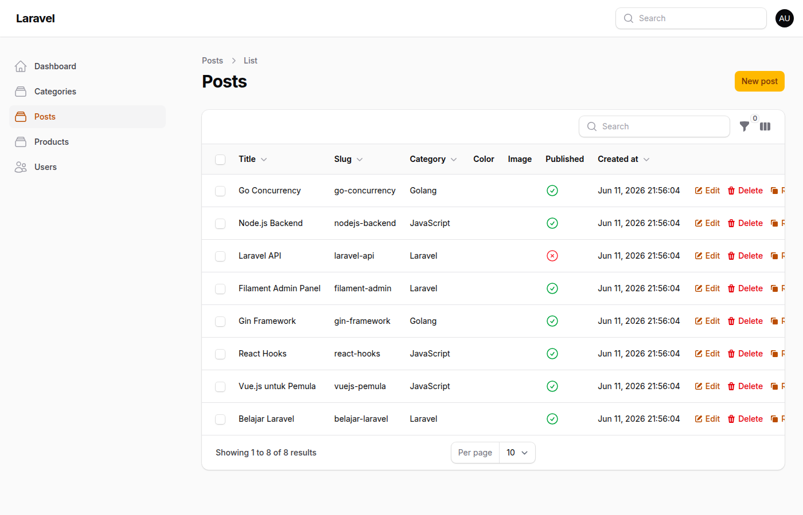
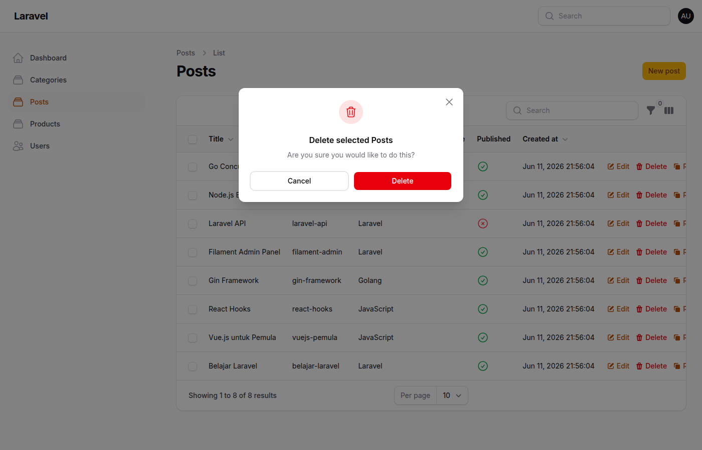
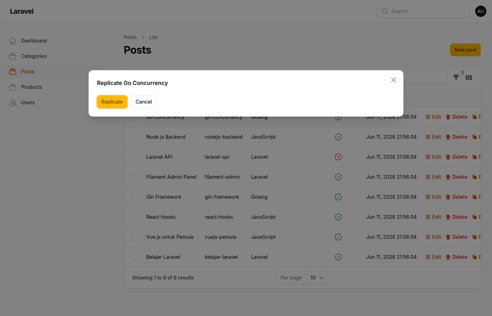

# JOBSHEET 13

**Nama:** Tri Aldy Kurniawan  
**NIM:** 244107020098

---

## Pertemuan 13 — Implementasi Table Actions & Custom Action di Filament

### Capaian Pembelajaran

Setelah mengikuti praktikum ini, mahasiswa mampu:
1. Menambahkan Record Actions pada tabel Filament
2. Menggunakan predefined actions (Edit, Delete, Replicate)
3. Membuat custom action pada tabel
4. Mengupdate data langsung dari tabel tanpa masuk ke halaman edit
5. Menambahkan label dan icon pada action
6. Memahami konsep callback/action function pada Filament

---

### Langkah-langkah Implementasi

#### Langkah 1 — Menambahkan DeleteAction

Buka file `app/Filament/Resources/Posts/Tables/PostsTable.php` dan tambahkan import:

```php
use Filament\Actions\DeleteAction;
```

Tambahkan DeleteAction di `recordActions`:

```php
->recordActions([
    EditAction::make(),
    DeleteAction::make(),
])
```

**Hasil:** Tombol Delete muncul di tabel. Saat diklik muncul confirmation dialog, dan data terhapus tanpa masuk ke halaman edit.

---

#### Langkah 2 — Menambahkan ReplicateAction

Tambahkan import:

```php
use Filament\Actions\ReplicateAction;
```

Tambahkan ReplicateAction di `recordActions`:

```php
->recordActions([
    EditAction::make(),
    DeleteAction::make(),
    ReplicateAction::make(),
])
```

**Hasil:** Tombol Replicate muncul. Saat diklik, record baru dibuat dengan data yang sama (copy data).

---

#### Langkah 3 — Membuat Custom Action (Status Change)

Tambahkan import:

```php
use Filament\Actions\Action;
use Filament\Forms\Components\Checkbox;
```

Tambahkan custom action untuk toggle publish/unpublish:

```php
Action::make('status')
    ->label('Status Change')
    ->icon('heroicon-o-check-circle')
    ->schema([
        Checkbox::make('published')
            ->default(fn($record): bool => $record->published),
    ])
    ->action(function ($record, $data) {
        $record->update(['published' => $data['published']]);
    })
    ->requiresConfirmation(),
```

**Hasil:** Tombol Status Change muncul dengan icon check-circle. Saat diklik, muncul modal dengan checkbox untuk toggle status published.

---

#### Langkah 4 — Tampilan Tabel dengan Semua Actions

Tampilan tabel Posts dengan 4 action buttons: Edit, Delete, Replicate, dan Status Change.



---

#### Langkah 5 — Delete Confirmation Dialog

Saat tombol Delete diklik, muncul confirmation dialog untuk mencegah penghapusan tidak sengaja.



---

#### Langkah 6 — Replicate Action

Saat tombol Replicate diklik, record baru dibuat dengan data yang sama.


---

#### Langkah 7 — Status Action Modal

Saat tombol Status Change diklik, muncul modal dengan checkbox untuk toggle status published.


---

#### Langkah 8 — After Status Update

Setelah checkbox di-toggle dan submit, status published berubah langsung dari tabel tanpa masuk ke halaman edit.



---

#### Langkah 9 — Final State

Tampilan final dengan semua actions bekerja dengan baik.


---

### Jawaban Pertanyaan Analisis & Diskusi

1. **Mengapa action di tabel lebih efisien dibanding halaman edit?**  
   Action di tabel memungkinkan user melakukan operasi cepat (edit, delete, replicate, toggle status) tanpa harus navigasi ke halaman edit terlebih dahulu. Ini menghemat waktu dan klik, terutama ketika user perlu melakukan operasi pada banyak record secara berurutan. User tetap di halaman list dan bisa langsung melihat hasil perubahan.

2. **Apa perbedaan predefined action dan custom action?**  
   Predefined action (Edit, Delete, Replicate, dll) sudah disediakan oleh Filament dengan logic bawaan yang siap pakai. Kita tinggal panggil `EditAction::make()` dan Filament menangani semuanya. Custom action dibuat sendiri untuk kebutuhan spesifik yang tidak tersedia di predefined actions, seperti toggle status, export data, atau operasi custom lainnya. Custom action memerlukan definisi schema, action callback, dan logic sendiri.

3. **Bagaimana cara menambahkan validasi dalam custom action?**  
   Validasi dalam custom action ditambahkan melalui method `schema()` yang mendefinisikan form input dengan rules validasi. Contohnya:
   ```php
   ->schema([
       TextInput::make('email')
           ->email()
           ->required(),
       Checkbox::make('published')
           ->required(),
   ])
   ```
   Filament akan otomatis memvalidasi input sebelum menjalankan `action()` callback. Jika validasi gagal, error message akan ditampilkan di modal.

4. **Kapan kita menggunakan Replicate?**  
   Replicate digunakan ketika kita ingin menduplikasi data yang sudah ada untuk membuat record baru dengan data yang mirip. Contoh kasus:
   - Membuat post baru berdasarkan post yang sudah ada (hanya perlu ubah beberapa field)
   - Duplikasi produk dengan spesifikasi serupa
   - Copy template atau konfigurasi yang sudah ada
   - Menghemat waktu input ketika banyak field yang sama
