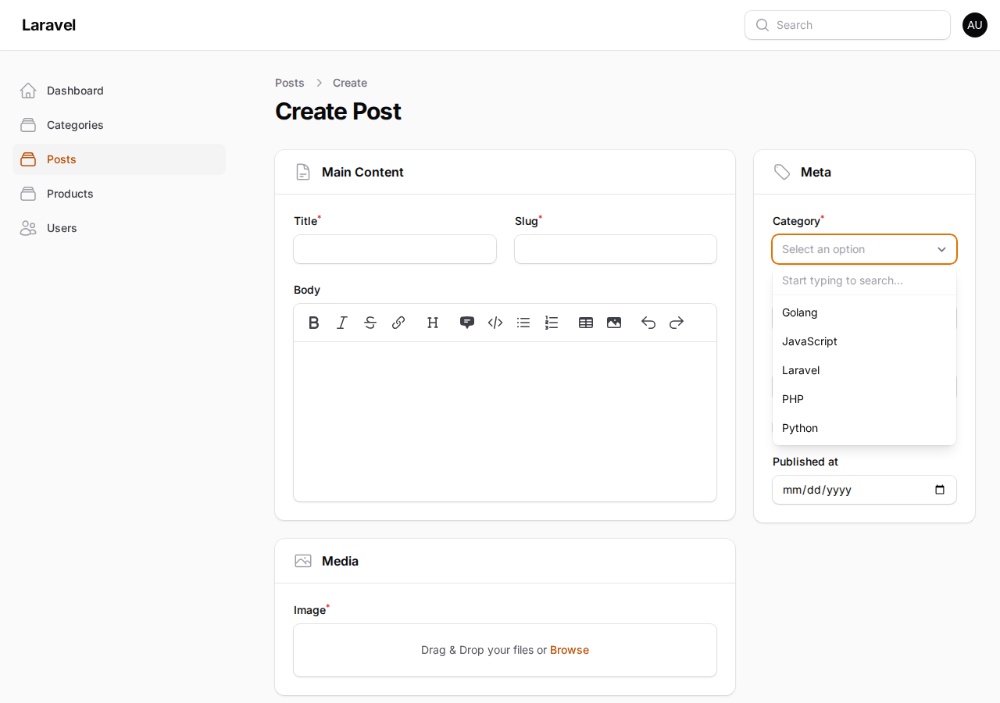
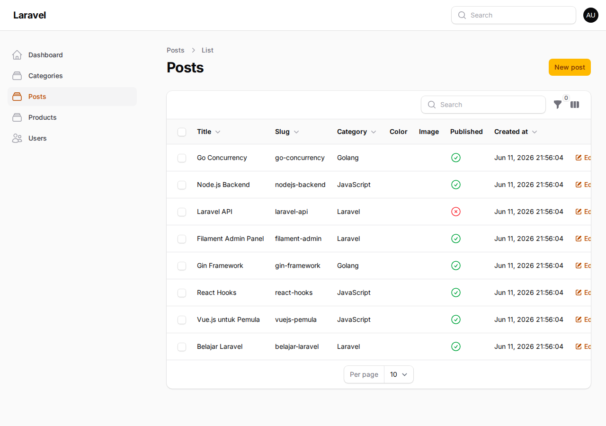
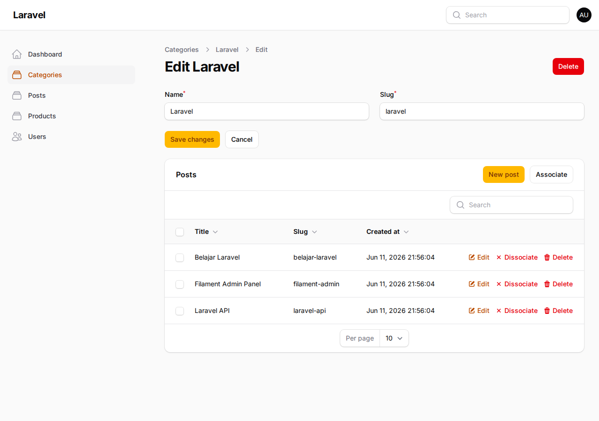
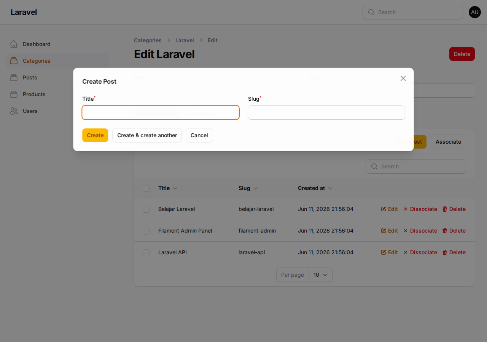

# Jobsheet 14 - Implementasi Relation pada Filament (HasMany)

**Nama:** Tri Aldy Kurniawan  
**NIM:** 244107020098  
**Mata Kuliah:** Pemrograman Web Lanjut  
**Pertemuan:** 14  

---

## A. Tujuan Praktikum

1. Memahami konsep relationship pada Laravel dan Filament
2. Menggunakan method `relationship()` pada form Filament
3. Mengimplementasikan searchable relationship dropdown
4. Menampilkan data relasi pada tabel Filament
5. Membuat Relationship Manager
6. Mengelola relasi HasMany pada Filament Admin Panel

---

## B. Implementasi

### 1. Menambahkan Relasi pada Model

**Model Category** (`app/Models/Category.php`):

```php
public function posts()
{
    return $this->hasMany(Post::class);
}
```

**Model Post** (`app/Models/Post.php`):

```php
public function category()
{
    return $this->belongsTo(Category::class);
}
```

### 2. Implementasi Relationship Dropdown pada Post Form

**File:** `app/Filament/Resources/Posts/Schemas/PostForm.php`

Mengubah Select category_id dari `->options()` menjadi `->relationship()`:

```php
Select::make('category_id')
    ->label('Category')
    ->relationship('category', 'name')
    ->searchable()
    ->preload()
    ->required(),
```

**Parameter:**
- `category` → nama relasi pada model
- `name` → field yang ditampilkan

**Hasil:** Dropdown kategori dengan fitur pencarian (searchable) dan preload data.



### 3. Menampilkan Data Relasi pada Tabel Post

**File:** `app/Filament/Resources/Posts/Tables/PostsTable.php`

Menambahkan kolom kategori pada tabel:

```php
TextColumn::make('category.name')
    ->label('Category')
    ->sortable()
    ->searchable()
    ->toggleable(),
```

**Hasil:** Tabel Post menampilkan nama kategori untuk setiap post.



### 4. Membuat Relationship Manager

Menjalankan command artisan:

```bash
php artisan make:filament-relation-manager CategoryResource posts title
```

**File yang dibuat:** `app/Filament/Resources/Categories/RelationManagers/PostsRelationManager.php`

### 5. Menghubungkan Relationship Manager ke CategoryResource

**File:** `app/Filament/Resources/Categories/CategoryResource.php`

```php
use App\Filament\Resources\Categories\RelationManagers\PostsRelationManager;

public static function getRelations(): array
{
    return [
        PostsRelationManager::class,
    ];
}
```

### 6. Menambahkan Kolom pada Relationship Table

**File:** `app/Filament/Resources/Categories/RelationManagers/PostsRelationManager.php`

```php
public function table(Table $table): Table
{
    return $table
        ->recordTitleAttribute('title')
        ->columns([
            TextColumn::make('title')
                ->searchable()
                ->sortable(),
            TextColumn::make('slug')
                ->searchable()
                ->sortable(),
            TextColumn::make('created_at')
                ->dateTime()
                ->sortable(),
        ])
        // ...
}
```

### 7. Membuat Form Create Post pada Relationship

```php
public function form(Schema $schema): Schema
{
    return $schema
        ->components([
            TextInput::make('title')
                ->required()
                ->maxLength(255),
            TextInput::make('slug')
                ->required()
                ->maxLength(255)
                ->unique(ignoreRecord: true),
        ]);
}
```

**Hasil:** Saat membuat post baru dari kategori, `category_id` otomatis terisi.





---

## C. Analisis & Diskusi

### 1. Apa perbedaan `relationship()` dengan `options()`?

**`options()`:**
- Memuat semua data sekaligus dari database
- Menggunakan array statis atau collection
- Tidak efisien untuk dataset besar
- Contoh: `->options(Category::all()->pluck('name', 'id'))`

**`relationship()`:**
- Menggunakan relasi Eloquent yang sudah didefinisikan di model
- Support fitur `searchable()` untuk pencarian dinamis
- Support `preload()` untuk memuat data awal
- Lebih efisien dan terintegrasi dengan ORM
- Contoh: `->relationship('category', 'name')`

### 2. Mengapa `searchable()` penting untuk dataset besar?

- **Performa:** Tidak perlu memuat semua data sekaligus ke dropdown
- **UX:** User bisa mencari kategori dengan mengetik, tidak perlu scroll panjang
- **Scalability:** Tetap efisien meskipun ada ribuan kategori
- **Lazy loading:** Data dimuat secara dinamis saat user mengetik

### 3. Apa fungsi Relationship Manager pada Filament?

Relationship Manager memungkinkan pengelolaan data relasi langsung dari resource parent tanpa berpindah halaman. Fitur yang tersedia:
- **View** data relasi dalam tabel
- **Create** record baru dengan foreign key otomatis terisi
- **Edit** record relasi
- **Delete** record relasi
- **Associate/Dissociate** untuk relasi many-to-many

### 4. Kapan menggunakan HasMany dan BelongsTo?

**HasMany** (Category → Posts):
- Satu record parent memiliki banyak record child
- Contoh: Satu kategori memiliki banyak post
- Didefinisikan di model parent (Category)

**BelongsTo** (Post → Category):
- Satu record child hanya memiliki satu record parent
- Contoh: Satu post hanya memiliki satu kategori
- Didefinisikan di model child (Post)

**Penggunaan:**
- Gunakan **HasMany** ketika ingin mengelola child records dari parent
- Gunakan **BelongsTo** ketika ingin menampilkan/memilih parent dari child
- Kedua relasi biasanya didefinisikan berpasangan untuk bidirectional relationship

---

## D. Keuntungan Menggunakan Relationship Manager

| Fitur | Manfaat |
|-------|---------|
| Manajemen relasi | Data relasi lebih mudah dikelola |
| CRUD langsung | Tidak perlu berpindah halaman |
| Otomatis isi foreign key | Mengurangi kesalahan input |
| Terintegrasi dengan resource | UI lebih konsisten |

---

## E. File yang Dimodifikasi

1. `app/Models/Category.php` - Menambahkan relasi `posts()`
2. `app/Filament/Resources/Posts/Schemas/PostForm.php` - Mengubah Select menjadi relationship dropdown
3. `app/Filament/Resources/Categories/CategoryResource.php` - Menambahkan PostsRelationManager
4. `app/Filament/Resources/Categories/RelationManagers/PostsRelationManager.php` - File baru untuk Relationship Manager

---

## F. Screenshot

1. **Dashboard Filament** - Halaman utama setelah login
2. **Posts Table dengan Category** - Menampilkan kolom kategori dari relasi
3. **Post Form dengan Searchable Dropdown** - Dropdown kategori dengan fitur pencarian
4. **Category Relationship Manager** - Tabel posts di halaman edit category
5. **Create Post from Category** - Modal create post dengan category_id otomatis
