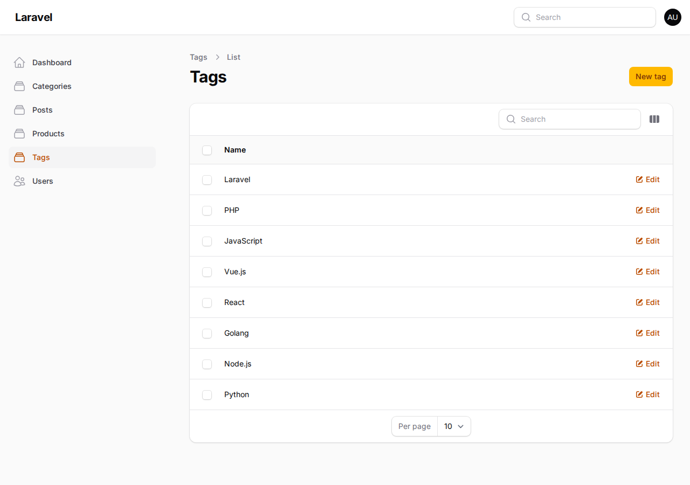
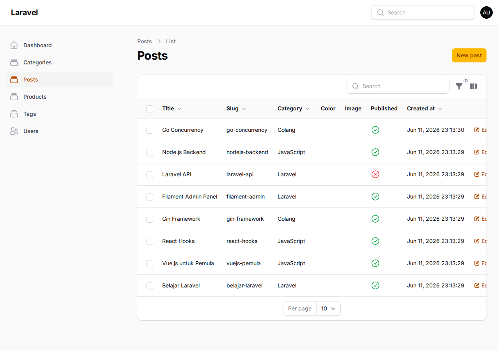
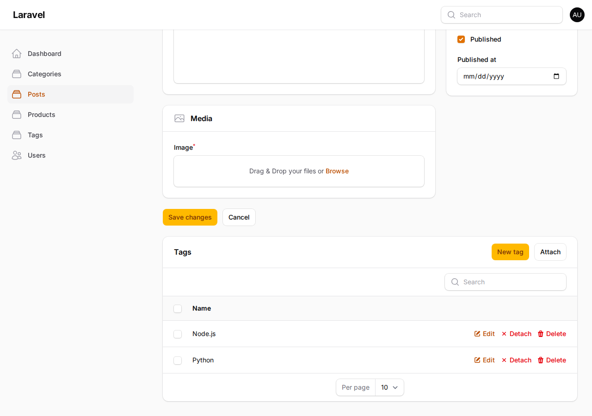
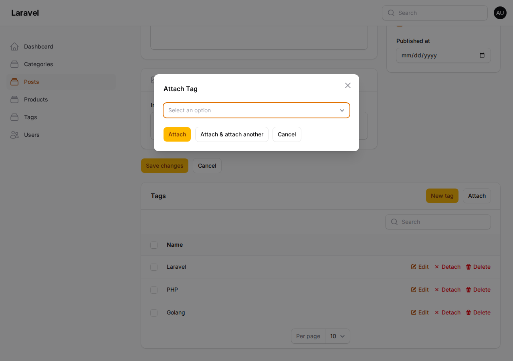

# Jobsheet 15 - Implementasi Many-to-Many Relationship pada Filament

**Nama:** Tri Aldy Kurniawan  
**NIM:** 244107020098  
**Mata Kuliah:** Pemrograman Web Lanjut  
**Pertemuan:** 15  

---

## A. Tujuan Praktikum

1. Memahami konsep Many-to-Many Relationship pada database
2. Membuat tabel relasi (pivot table) pada Laravel
3. Menghubungkan model menggunakan belongsToMany
4. Menggunakan multiple select relationship pada form Filament
5. Membuat Tag Resource pada Filament Admin Panel
6. Mengelola relasi menggunakan Relationship Manager

---

## B. Latar Belakang

Pada sistem blog, satu Post dapat memiliki banyak Tag, dan satu Tag dapat digunakan oleh banyak Post. Relasi ini disebut **Many-to-Many Relationship** dan membutuhkan **pivot table** untuk menghubungkan kedua tabel.

**Contoh:**
| Post | Tags |
|------|------|
| Laravel CRUD | Laravel, PHP |
| Laravel Tutorial | Laravel |
| PHP Basic | PHP |

**Sebelumnya:** Tag disimpan dalam format JSON di tabel posts
**Kelemahan:**
- Data sulit dimodifikasi
- Duplikasi data
- Tidak efisien untuk query database
- Tidak terstruktur

**Solusi:** Menggunakan Many-to-Many Relationship dengan tabel pivot.

---

## C. Implementasi

### 1. Rollback Migration

```bash
php artisan migrate:rollback --step=2
```

Rollback dilakukan untuk menghapus tabel posts dan products, kemudian modifikasi migration untuk menambahkan tabel tags dan pivot table post_tag.

### 2. Modifikasi Migration

**File:** `database/migrations/2026_04_23_124733_create_posts_table.php`

**Perubahan:**
- Hapus kolom `$table->json('tags')`
- Tambah tabel `tags`
- Tambah pivot table `post_tag`

```php
Schema::create('tags', function (Blueprint $table) {
    $table->id();
    $table->string('name');
    $table->timestamps();
});

Schema::create('post_tag', function (Blueprint $table) {
    $table->foreignId('post_id')
        ->constrained()
        ->cascadeOnDelete();
    $table->foreignId('tag_id')
        ->constrained()
        ->cascadeOnDelete();
    $table->primary(['post_id','tag_id']);
});
```

### 3. Jalankan Migration

```bash
php artisan migrate
```

### 4. Membuat Model Tag

```bash
php artisan make:model Tag
```

**File:** `app/Models/Tag.php`

```php
<?php

namespace App\Models;

use Illuminate\Database\Eloquent\Model;

class Tag extends Model
{
    protected $fillable = [
        'name',
    ];

    public function posts()
    {
        return $this->belongsToMany(Post::class, 'post_tag');
    }
}
```

### 5. Update Model Post

**File:** `app/Models/Post.php`

**Perubahan:**
- Hapus `'tags'` dari `$fillable`
- Hapus `'tags' => 'array'` dari `$casts`
- Tambah relasi `tags()`

```php
public function tags()
{
    return $this->belongsToMany(Tag::class, 'post_tag');
}
```

### 6. Membuat Tag Resource

```bash
php artisan make:filament-resource Tag --generate
```

**File yang dibuat:**
- `app/Filament/Resources/Tags/TagResource.php`
- `app/Filament/Resources/Tags/Pages/CreateTag.php`
- `app/Filament/Resources/Tags/Pages/EditTag.php`
- `app/Filament/Resources/Tags/Pages/ListTags.php`
- `app/Filament/Resources/Tags/Schemas/TagForm.php`
- `app/Filament/Resources/Tags/Tables/TagsTable.php`

**TagForm:**
```php
TextInput::make('name')
    ->required(),
```

**TagsTable:**
```php
TextColumn::make('name')
    ->searchable(),
```

### 7. Update PostForm - Multiple Select Tags

**File:** `app/Filament/Resources/Posts/Schemas/PostForm.php`

**Sebelum:**
```php
TagsInput::make('tags'),
```

**Sesudah:**
```php
Select::make('tags')
    ->relationship('tags', 'name')
    ->multiple()
    ->preload(),
```

**Penjelasan:**
- `relationship('tags', 'name')` - mengambil data dari relasi tags
- `multiple()` - memungkinkan memilih lebih dari satu tag
- `preload()` - memuat data tags saat form di-load

### 8. Update PostsTable - Tampilkan Tags sebagai Badge

**File:** `app/Filament/Resources/Posts/Tables/PostsTable.php`

```php
TextColumn::make('tags.name')
    ->label('Tags')
    ->badge()
    ->separator(',')
    ->toggleable(isToggledHiddenByDefault: true),
```

### 9. Membuat Tags Relation Manager

```bash
php artisan make:filament-relation-manager PostResource tags name
```

**File:** `app/Filament/Resources/Posts/RelationManagers/TagsRelationManager.php`

### 10. Hubungkan Relation Manager ke PostResource

**File:** `app/Filament/Resources/Posts/PostResource.php`

```php
use App\Filament\Resources\Posts\RelationManagers\TagsRelationManager;

public static function getRelations(): array
{
    return [
        TagsRelationManager::class,
    ];
}
```

---

## D. Struktur Database

### Tabel Posts
```
posts
---------
id
title
slug
category_id
color
image
body
published
published_at
```

### Tabel Tags
```
tags
---------
id
name
```

### Pivot Table
```
post_tag
---------
post_id (foreign key → posts)
tag_id (foreign key → tags)
Primary Key: [post_id, tag_id]
```

---

## E. Hasil Implementasi

### 1. Tag Resource

Halaman Tag Resource menampilkan daftar tags dengan fitur CRUD.



### 2. Posts Table dengan Tags Badge

Tabel Posts menampilkan tags dalam format badge.



### 3. Post Form dengan Multiple Tags Select

Form Post menampilkan dropdown tags yang memungkinkan memilih lebih dari satu tag.



### 4. Tags Dropdown

Dropdown tags menampilkan semua tags yang tersedia untuk dipilih.


### 5. Tags Relation Manager

Relationship Manager Tags di halaman Edit Post memungkinkan mengelola tags langsung dari post.


### 6. Attach Tag Modal

Modal Attach Tag untuk menambahkan tag baru ke post.



---

## F. Analisis & Diskusi

### 1. Apa perbedaan HasMany dan Many-to-Many?

**HasMany (One-to-Many):**
- Satu record parent memiliki banyak record child
- Satu child hanya memiliki satu parent
- Contoh: Category → Posts (satu kategori punya banyak post)
- Foreign key ada di tabel child (posts.category_id)

**Many-to-Many:**
- Satu record A memiliki banyak record B
- Satu record B juga memiliki banyak record A
- Contoh: Post ↔ Tag (satu post punya banyak tag, satu tag dipakai banyak post)
- Membutuhkan pivot table untuk menghubungkan

### 2. Mengapa pivot table diperlukan?

Pivot table diperlukan karena:
- **Relasi dua arah:** Post bisa punya banyak Tag, Tag bisa dipakai banyak Post
- **Normalisasi database:** Menghindari duplikasi data
- **Fleksibilitas:** Mudah menambah/menghapus relasi tanpa mengubah data utama
- **Query efisien:** JOIN operation lebih cepat daripada parsing JSON

### 3. Apa fungsi attach dan detach pada Filament?

**Attach:**
- Menambahkan relasi antara Post dan Tag
- Insert record baru di pivot table (post_tag)
- Contoh: Post "Belajar Laravel" di-attach dengan Tag "PHP"

**Detach:**
- Menghapus relasi antara Post dan Tag
- Delete record dari pivot table
- Data Post dan Tag tetap ada, hanya relasinya yang dihapus

### 4. Mengapa JSON column kurang baik untuk relasi?

**Kelemahan JSON column:**
- **Tidak terstruktur:** Data sulit di-query dan di-filter
- **Duplikasi data:** Tag "Laravel" bisa tertulis berbeda-beda
- **Sulit dimodifikasi:** Harus parse JSON, modifikasi, encode ulang
- **Tidak ada referential integrity:** Bisa ada tag yang tidak valid
- **Query lambat:** Tidak bisa pakai JOIN, harus full-text search

**Keuntungan Many-to-Many:**
- **Terstruktur:** Data tersimpan rapi di tabel terpisah
- **Normalisasi:** Tidak ada duplikasi
- **Mudah dimodifikasi:** CRUD operations standar
- **Referential integrity:** Foreign key constraints
- **Query efisien:** JOIN operations

---

## G. Keuntungan Many-to-Many Relationship

| JSON Column | Many-to-Many |
|-------------|--------------|
| Tidak terstruktur | Struktur database jelas |
| Data duplikat | Normalisasi database |
| Query sulit | Query mudah |
| Sulit dimodifikasi | Mudah dikelola |

---

## H. File yang Dimodifikasi

1. `database/migrations/2026_04_23_124733_create_posts_table.php` - Hapus kolom tags, tambah tabel tags & post_tag
2. `app/Models/Post.php` - Hapus tags dari fillable/casts, tambah relasi belongsToMany
3. `app/Models/Tag.php` - Model baru dengan relasi belongsToMany
4. `app/Filament/Resources/Posts/Schemas/PostForm.php` - Ganti TagsInput jadi Select multiple
5. `app/Filament/Resources/Posts/Tables/PostsTable.php` - Ubah kolom tags jadi badge
6. `app/Filament/Resources/Posts/PostResource.php` - Hubungkan TagsRelationManager
7. `app/Filament/Resources/Tags/` - TagResource baru (auto-generated)
8. `app/Filament/Resources/Posts/RelationManagers/TagsRelationManager.php` - RelationManager baru

---

## I. Screenshot

1. **Dashboard Filament** - Halaman utama setelah login
2. **Tag Resource** - Daftar tags dengan fitur CRUD
3. **Posts Table** - Tabel posts dengan tags badge
4. **Post Form** - Form edit post dengan multiple tags select
5. **Tags Dropdown** - Dropdown tags yang bisa dipilih multiple
6. **Tags Relation Manager** - Relationship manager di edit post
7. **Attach Tag Modal** - Modal untuk attach tag baru
